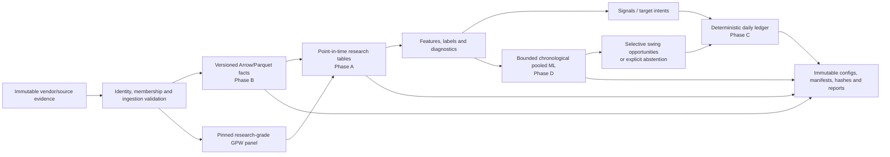

# ATS

ATS is a correctness-first research and backtesting project for point-in-time
equity research, immutable analytical data, and auditable portfolio simulation.
The current implementation is centered on the Warsaw Stock Exchange (GPW), with
U.S. daily data used in the canonical-data work.

The project is deliberately not a live trading system yet. Its present goal is
to determine whether a small number of research hypotheses—including a bounded
pooled-ML swing-opportunity experiment—justify further engineering.

## Current checkpoint

Status as of 2026-09-02:

- The architecture study and local storage/query/backtester benchmarks are
  complete.
- Phase A established the point-in-time TOP60 research contracts and preserved
  the accepted historical diagnostic evidence.
- A research-grade GPW panel now combines source/native Bossa, Investing.com and
  explicitly approved Yahoo observations, then applies bounded split
  normalization. It retains exactly 60 official PIT members per session from
  2019-12-23, but it is not a canonical Phase B or total-return publication.
- Phase A v2 found that proximity to the strict trailing high deserved one
  bounded economic falsification test. The repaired long-only Q5 test reported a
  15.02% after-cost price-only CAGR versus 12.39% for its same-eligibility
  benchmark over the controlling common period. This is hypothesis evidence,
  not untouched validation or deployable alpha.
- Phase B implements immutable Arrow/Parquet data contracts, transactional
  publication, lineage, DuckDB/Polars readers, and pinned GPW/U.S. versions.
- Phase C implements and independently validates a deterministic daily portfolio
  ledger with next-open timing, explicit costs, cash scaling, missing-price
  states, and corporate/security-event hooks.
- The repaired pre-Phase-D market-state diagnostic is complete. Its 12-variable
  numerical context block is ready with caveats; historical association is
  mixed, pairwise correlation is the only frozen block variable meeting the
  descriptive heterogeneity flag, and no market ON/OFF rule is authorized.
- The final pre-D2 D0/D1 v3 chronology amendment is complete and structurally
  PASS. The locked object is now a deterministic January/July refit procedure:
  each model uses the trailing 36 calendar months, calibrates from exactly three
  prior six-month out-of-fit score blocks, refits on all label-mature rows and
  scores the next six-month block. Decisive evidence uses complete blocks only;
  partial 2026 H2 through 2026-08-18 is monitoring only.
- D1 v3 fixture-proves exact endpoint purging, prequential fit/score order,
  threshold/final-refit separation, shared four-cell semantic populations and
  the locked prediction-generation firewall. Immutable structural run
  `phase-d1-v3-structural-ed315ee058c7e0e7ce51` resolves every outer/inner
  boundary and frozen minimum. No real Phase D label value, fit, prediction,
  score, metric, outcome or model-family result was accessed.
- Accepted D0 v2, rejected/accepted D1 v1/v2 publications and immutable D1 v2
  run `phase-d1-structural-b4fb9bbc480c2026e423` remain preserved historical
  evidence. The unchanged 30-feature registry and all eight P survivors are
  carried forward by hash, not silently rewritten.
- Phase D2 executed the one authorized frozen pooled-ML study. Audit v2 verifies
  the scientific `STOP`; execution integrity is `NOT FULLY PROVEN` because the
  accepted v4 trace cannot prove literal sequential label admission. 78
  of 177 prespecified scientific gates failed. The mechanically derived verdict
  is `STOP`: the rich representation did not provide material, stable, and
  economically relevant incremental information beyond both conventional
  comparators.
- The accepted prediction table, locked sequence, all evaluation stages, and
  final verdict reproduce exactly by scientific logical hash; an evaluator that
  imports no primary metric functions independently matches a bounded core of
  metrics and the verdict, while reclassifying—not independently recomputing—
  the remaining stored gate inputs. Phase D3 and portfolio/backtest
  work remain unauthorized pending owner review.

The automatic Phase D2 authorization overlay activated from committed baseline
`1dc9bbd`. The authorized study is now complete. The next gate is **owner review
of the retained negative Phase D2 result**; this checkpoint does not authorize
new ML research, Phase D3 execution, portfolio translation, optimization, or
deployment.

Authoritative current documents:

- [research operating policy](RESEARCH/RESEARCH_OPERATING_POLICY.md)
- [implementation roadmap](RESEARCH/IMPLEMENTATION_ROADMAP.md)
- [Phase D pooled-ML charter](RESEARCH/PHASE_D_POOLED_ML_RESEARCH_CHARTER.md)
- [Phase D0 v3 experiment plan](RESEARCH/PHASE_D0_EXPERIMENT_PLAN_v3.md)
- [preserved Phase D0 v2 experiment plan](RESEARCH/PHASE_D0_EXPERIMENT_PLAN.md)
- [Phase D0 30-feature owner-review table](RESEARCH/PHASE_D0_FEATURE_REGISTRY_TABLE.md)
- [Phase D1 readiness v3](RESEARCH/PHASE_D1_READINESS_v3.md)
- [Phase D2 authorization overlay](RESEARCH/PHASE_D2_AUTHORIZATION_OVERLAY.md)
- [Phase D2 execution freeze](RESEARCH/PHASE_D2_EXECUTION_FREEZE.md)
- [Phase D2 results](RESEARCH/PHASE_D2_RESULTS.md)
- [Phase D2 bounded audit repair](RESEARCH/PHASE_D2_AUDIT_REPAIR.md)
- [Phase D2 requirement audit](RESEARCH/PHASE_D2_REQUIREMENT_AUDIT.json)
- [Phase D2 evidence manifest](RESEARCH/PHASE_D2_MANIFEST.json)
- [preserved Phase D1 readiness v2](RESEARCH/PHASE_D1_READINESS_v2.md)
- [controlling market-state checkpoint](RESEARCH/PRE_PHASE_D_MARKET_STATE_DIAGNOSTIC.md)
- [recommended architecture](RESEARCH/RECOMMENDED_ARCHITECTURE.md)

## How the system fits together



The boundaries matter:

- Vendor files are evidence, not silently cleaned truth.
- Stable `security_id` values own identity; tickers and vendor symbols are
  validity-dated aliases.
- Official universe membership and the expected denominator remain visible. A
  calculation using 57 priced members of an official TOP60 records `57/60` and
  the three exclusion states.
- Features use only information available by their decision timestamp. Forward
  outcomes live under the label boundary and are inaccessible to feature code.
- Research statistics are not portfolio returns. Executable evidence requires
  explicit intents, next-open timing, orders, fills, costs, cash and valuation.
- Every accepted run pins inputs, code/environment state and logical/physical
  artifacts. Existing accepted runs are never edited in place.

## Repository guide

| Path | Purpose |
|---|---|
| [`source/python/src/ats_contracts`](source/python/src/ats_contracts) | Shared Pydantic/Arrow contracts and semantic validation. |
| [`source/python/src/ats_research`](source/python/src/ats_research) | Phase A identity, PIT membership, panels, features, labels and diagnostics. |
| [`source/python/src/ats_data`](source/python/src/ats_data) | Phase B ingestion, immutable publication, manifests and reconciliation. |
| [`source/python/src/ats_portfolio`](source/python/src/ats_portfolio) | Phase C deterministic event/ledger engine and independent validation. |
| [`source/python/tests`](source/python/tests) | Main contract, research, data and portfolio regression suites. |
| [`source/python/configs`](source/python/configs) | Retained reference configurations and intent fixtures. |
| [`source/python/notebooks`](source/python/notebooks) | Executable orientation notebooks explaining data, research and ledger flow. |
| [`RESEARCH`](RESEARCH) | Architecture decisions, phase reports, research findings and retained evidence. |
| [`RESEARCH/prototypes`](RESEARCH/prototypes) | Bounded benchmark/research implementations; not a second production package. |
| [`RESEARCH/environment`](RESEARCH/environment) | Stable Windows/Conda invocation helpers used by current validation commands. |

The Python package metadata and CLI entry points are in
[`source/python/pyproject.toml`](source/python/pyproject.toml). The installed
commands are `ats-research`, `ats-data`, `ats-portfolio`, and the structural
`ats-ml` command. Phase D2 uses `python -m ats_ml.d2_cli`; those subcommands
preserve the prediction/evaluation firewall and validate sealed Stage 1,
Stage 2A, Stage 2B, Stage 2C, and final publications.

## Data and artifact locations

Large or private data is intentionally outside Git:

```text
D:\Stock\data\
  ... vendor/source archives ...       immutable input evidence
  ATS\
    phase_a\runs\                      accepted research runs
    phase_b\versions\                  immutable canonical versions
    phase_c\runs\                      immutable portfolio ledgers
    gpw_split_normalization\runs\      research-grade candidate panels
    phase_a_v2_research\runs\          Phase A v2 evidence
    phase_a_v2_strategy_test\runs\     bounded strategy translations
    pre_phase_d_market_state\runs\     market-state diagnostic evidence
    phase_d_ml\structural_runs\         immutable D1 structural evidence
    phase_d_ml\prediction_runs\         immutable D2 outcome-free predictions
    phase_d_ml\evaluation_runs\         immutable D2 evaluation and verdicts
    phase_d_ml\reproductions\           independent D2 logical reproductions
```

Do not modify vendor observations or accepted run/version directories. New data,
corrections and experiments create new versioned directories. Discovery pointers
such as `*.current.json` are convenience only; research and validation must pin an
explicit manifest.

Generated caches and temporary runtime files belong under the documented cache
or `.tmp` roots and are excluded from Git. Commit code, small fixtures,
configuration, plans and concise reports—not downloaded market history or large
generated tables.

## Reproduce and test

The supported Windows entry point activates the isolated Conda runtime, required
DLL paths, `PYTHONPATH`, and writable temporary/cache directories:

```powershell
$atsPython = 'D:\Stock\ATS\RESEARCH\environment\invoke_ats_python.ps1'
```

Run the main Python suite from the package directory:

```powershell
Set-Location 'D:\Stock\ATS\source\python'
& $atsPython -m pytest -q
```

Run the controlling pre-Phase-D regression suite from the repository root:

```powershell
Set-Location 'D:\Stock\ATS'
& $atsPython -m pytest -q 'D:\Stock\ATS\RESEARCH\prototypes\pre_phase_d_market_state\tests'
```

Inspect the available CLIs:

```powershell
& $atsPython -m ats_research --help
& $atsPython -m ats_data --help
& $atsPython -m ats_portfolio --help
```

Reference run/validation commands and accepted manifest conventions are kept in:

- [Python implementation guide](source/python/README.md)
- [Phase B canonical-data contract](source/python/PHASE_B.md)
- [Phase C portfolio-ledger contract](source/python/PHASE_C.md)
- [notebook guide](source/python/notebooks/README.md)

## Roadmap

| Phase | State | Purpose / next gate |
|---|---|---|
| Architecture study | Complete | Local technology, Parquet-layout and engine evidence; measured defaults rather than permanent rules. |
| Phase A | Accepted and preserved | Correct PIT research slice, denominator/missingness discipline, features and forward diagnostics. |
| Phase B | Implemented | Immutable canonical analytical facts and transactional publication; the newer split-normalized research panel is deliberately not promoted yet. |
| Phase C | Implemented and repaired | Deterministic daily portfolio accounting and independent ledger reconstruction. |
| Phase A v2 / proximity | Bounded test passed its frozen hurdles | Retained conventional benchmark only; one later bounded validation remains, with no parameter optimization. |
| Pre-Phase D market state | Complete | Carry the compact numerical block as context; do not turn it into a timing strategy. |
| Phase D0 | v3 frozen; v2 preserved | Final chronology amendment locks January/July refits, trailing 36-month windows, three-block prequential calibration, complete-block evidence mappings and unchanged scientific definitions. |
| Phase D1 | v3 complete — PASS | 80 focused tests, 187 full regressions and immutable structural run `phase-d1-v3-structural-ed315ee058c7e0e7ce51`; every structural minimum passes and no real predictive operation occurred. Accepted v2 evidence remains unchanged. |
| Phase D2/D3 | D2 STOP verified / D3 not authorized | Audit v2 preserves the accepted predictions and verifies the negative result. Historical execution integrity is NOT FULLY PROVEN because sequential label admission was not retained; independent coverage is explicitly bounded. No D3 or portfolio translation. |
| Phase E/F | Trigger-driven / later | Optimize measured pain and add richer reporting only when the completed vertical slice demonstrates a need. |

Phase D is a pooled learner but not an always-invested portfolio. It evaluates
eligible security-sessions while cash/no position remains the default. The core
question is whether a compact rich-state representation adds stable and
economically meaningful selective swing-opportunity information beyond the
strongest conventional representation. Approximately tying the conventional
baseline is failure, not success.

## Research interpretation

The following distinctions should survive every future report:

- `split_adjusted_price_return` removes known split mechanics but excludes cash
  distributions and preserves dividend price gaps. It is not total return.
- Stooq-adjusted historical evidence, source/native observations and the newer
  split-adjusted price-only panel are different bases and must not be merged
  semantically.
- Historical outcomes through 2026-08-18 have influenced this research program.
  A later segment may be called a locked historical test, but genuinely forward
  evidence begins only after that boundary.
- Rank IC, quantile spreads and approximate cost screens are diagnostics. They do
  not establish fillability, portfolio economics or deployable alpha.
- LEAN and NautilusTrader remain optional future adapters. They are justified
  only by a concrete live/intraday requirement and must first reproduce the
  neutral ATS contracts and golden ledger.

## Working rules

The project-wide rules are defined in the
[research operating policy](RESEARCH/RESEARCH_OPERATING_POLICY.md). Its priority
rule is: **additional infrastructure must justify itself through research need.**

For each bounded step, name the decision, cheapest credible experiment,
must-have validity work, useful diagnostics, deferred work and stop/continue
rule. Minimum rigor still includes any PIT timing, leakage, denominator,
missing-state, price-basis or accounting issue capable of changing the result.
Freeze and reproduce accepted decision evidence, not every disposable diagnostic.

Preserve accepted runs, prior versions, negative results and unrelated dirty
work. Correct bugs within the smallest demonstrated scope. Do not optimize after
viewing results or let secondary diagnostics silently create new research
branches.

## Documentation maintenance

This file is the project entry point, not the full evidence archive. Update its
**Current checkpoint**, **Roadmap**, authoritative links and supported commands
whenever a phase gate or repository boundary changes. Put detailed methodology,
hashes, metrics and caveats in the phase report, then link that report here. Do
not silently rewrite the meaning of an earlier accepted artifact to make the
summary look current. Replay a historical phase validator against its accepted
Git checkpoint; never roll current controlling guidance back merely to satisfy
hashes frozen by an older whole-repository manifest.
