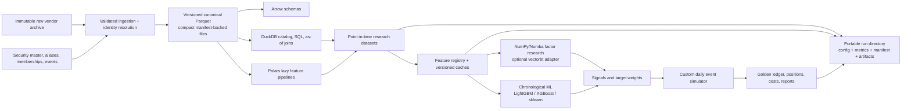

# Recommended Architecture

**Choose Arrow schemas + immutable logical versions of ZSTD Parquet; DuckDB for SQL/catalog access; Polars lazy for feature transforms; pandas only at compatibility boundaries; NumPy/Numba for transparent factor research; a narrow custom daily event simulator; scikit-learn/LightGBM with XGBoost as challenger; Pydantic-validated YAML; portable filesystem run manifests; Plotly/matplotlib for reporting. Add MLflow only when run volume justifies an index/UI.**

**MVP physical layout:** use one compact file, or a very small set of compact files, per `(table, market, frequency)`. The initial GPW daily and hourly datasets do not need time partitions. Sort bars by `(security_id, event_ts, source, adjustment_version)`. Configure ZSTD level 3 and 122,880-row groups as benchmark-derived defaults, not permanent architecture. Publish a complete immutable logical version with a small manifest; rebuilding a roughly 1-GB file is currently cheaper and safer than operating delta files and compaction. Do not partition or bucket by ticker/security.

## Twenty implementable decisions

### 1. What is canonical?

Immutable raw source files are evidence; versioned normalized Parquet is the canonical analytical store. DuckDB tables, wide panels, feature matrices and notebook frames are derived and reproducible.

### 2. What are the daily partition keys?

For the MVP use `table/market=<market>/frequency=daily/part-000.parquet`, with at most a few deterministic `part-NNN` files if a writer needs them. The manifest records the exact files and min/max timestamps. Add a time partition when representative query or rebuild SLOs are missed, or when file size materially harms publication, correction or maintenance. An approach toward 2 GiB is a configurable review prompt, not a permanent split threshold.

### 3. What are the intraday partition keys?

Use `table/market=GPW/frequency=hourly/part-000.parquet` for the present 28.6-MB corpus. Introduce `year`, and later possibly `month`, only when files become materially larger and a representative benchmark shows a benefit. The local 26-file monthly candidate was slower on broad and security retrieval with no 30-day advantage.

### 4. What is the within-file sort order?

`security_id`, `event_ts`, `source`, `adjustment_version`. Time-directory pruning handles broad date filters; sorting clusters each security for row-group pruning. Membership and event tables sort by entity key then validity/event and availability timestamps.

### 5. Which compression and row groups?

Start with ZSTD level 3 and `ROW_GROUP_SIZE=122880` rows for the narrow bar schema (about 4–8 MiB uncompressed in the observed data). These are versioned writer settings, not semantic contracts. The measured 64/128/256-MiB groups progressively damaged selective reads without meaningful ZSTD savings; Snappy at the 128-MiB target used about 50% more disk. Change the defaults only through a reproducible layout benchmark.

### 6. What file size is targeted?

Prefer 100 MiB–1 GiB compact files and allow one naturally smaller whole-market file. Split when representative query/rebuild SLOs are missed or file size materially harms maintenance; keep 2 GiB only as a configurable initial review default. This stays close to Arrow and DuckDB guidance while avoiding unnecessary file lifecycle machinery ([Arrow](https://arrow.apache.org/docs/python/dataset.html), [DuckDB](https://duckdb.org/docs/current/guides/performance/file_formats)).

### 7. Is there a security bucket?

No. Never partition by ticker/security. The measured 16-way candidate created 3,477 files and remained about 34× slower than the control for a correctly bucket-pruned one-security query. Reconsider a stable `xxhash64(security_id) % 32` bucket only when a materially large intraday partition misses the market-qualified single-security P95 SLO and simpler sorting/time splitting cannot meet it.

### 8. How are appends and corrections performed?

Land inputs with source checksums, schema version and `ingest_batch_id`; validate and deduplicate semantic keys. For the MVP, rebuild the affected compact table into a new version directory, verify row counts/checksums, then publish its manifest. Corrections create another complete logical version. Parquet files are never edited in place, and an experiment never follows an unpinned `latest` pointer.

### 9. What is the compaction policy?

There is no scheduled compactor in the MVP because canonical publication writes compact files directly. Introduce delta publication and compaction only when full-version rebuild time, storage amplification, or ingestion cadence becomes a measured problem. The future policy must be copy-on-write and record input/output checksums, duration and bytes rewritten.

### 10. May markets use different layouts?

Not initially. GPW and US share the same coarse `(table, market, frequency)` convention and logical schema. Different time partitions are allowed later only after market-specific size/access evidence is recorded in configuration and benchmarks; they must remain hidden behind the same manifest-backed dataset view.

### 11. How does DuckDB discover the lake?

A lightweight DuckDB catalog contains no canonical bar copy. It stores security metadata and manifest-backed views built from explicit file lists. `union_by_name=false` and schema-fingerprint checks make drift fail closed. Experiment reads pin a dataset version, never an unqualified `latest`. More elaborate catalog automation waits until multiple physical layouts actually exist.

### 12. What is stable security identity?

`security_master(security_id UUID, issuer_id, instrument_type, base_currency, valid_from, valid_to, status)`. A separate `security_identifier` table stores `(security_id, identifier_type, identifier_value, venue_mic, vendor, valid_from, valid_to, provenance, resolution_status)`. Ticker, ISIN and vendor codes are aliases, never primary identities. Interval overlaps for the same namespace are rejected unless explicitly adjudicated.

### 13. What is the bar schema?

`security_id`, `event_ts`, `available_ts`, `session_date`, `market`, `venue_mic`, `frequency`, `open`, `high`, `low`, `close`, `volume`, optional `turnover`, `currency`, `source`, `adjustment_state`, `adjustment_version`, `ingest_batch_id`, `ingested_at`, `quality_flags`, `schema_version`. Decimal/raw price policy is source-specific; research projections may use float64/float32 explicitly.

### 14. How are membership and events represented?

Universe membership is interval-based: `universe_id`, `security_id` nullable for unresolved members, raw identifier, `valid_from`, `valid_to`, `announced_at`, `available_ts`, source, provenance and resolution status. Corporate actions and generic events retain `event_ts`, `available_ts`, terms, source, revision and linked securities. Unresolved members and benign exits remain first-class states.

### 15. How are macro, features and predictions represented?

Macro/market facts have series identity, observation/event time, availability time, value, source and revision/vintage. Feature values key on entity/session, feature version and `as_of_ts`. Predictions additionally store model/run/version, horizon and decision timestamp. Long canonical facts may be materialized into versioned wide caches for bounded research.

### 16. What is the feature registry?

Start with a Python decorator or frozen dataclass declaring name, integer version, frequency, lookback, dependencies and implementation fingerprint. Timestamp semantics and tests remain mandatory; richer dtype, null, adjustment and cache policy fields can be added when a feature needs them. Feature values are derived/cacheable, never canonical.

### 17. How are experiments configured and tracked?

YAML is parsed into Pydantic models. Each `runs/<run_id>/` directory contains `config.yaml`, `metrics.json`, `manifest.json` and `artifacts/`; the manifest records dataset/universe versions, timing, features, labels, folds, costs, seed, engine versions, Git commit and artifact hashes. This portable filesystem contract is authoritative. MLflow may index it later but must not replace it.

### 18. How is point-in-time correctness enforced?

Every joined input must satisfy `available_ts <= decision_ts`. Close-derived features at session *t* can fill no earlier than the next eligible session's open. As-of joins are backward and tolerance-bounded. Membership boundaries, suspensions and unresolved states are explicit. Cross-sectional outputs retain the official membership denominator and exclusion reason—`57/60`, not a silently redefined 57-security universe. Forward returns are labels only and inaccessible to feature code. Chronological folds fit preprocessing on training dates only, preserve date groups, and prevent training feature/label information intervals from overlapping information unavailable at the validation decision boundary. For simple forward-return labels, the default purge is at least the maximum label horizon; overlapping events, holding-period targets or other sampling structures may require a larger or structurally different exclusion.

### 19. What are the research and event contracts?

Research consumes a point-in-time table and emits immutable `Signal`/`TargetWeight` records with run ID, security ID, decision timestamp, eligible execution window and reason codes. The simulator consumes those records plus bars/events and emits append-only orders, fills, cash movements, positions and valuations. Accounting invariants and a golden ledger—not a framework's summary return—define correctness.

### 20. When are LEAN or NautilusTrader justified?

LEAN is justified when a supported broker/live deployment, its calendar/data ecosystem, or cloud/local operational parity is a funded requirement. NautilusTrader is justified when hourly evolves to higher-frequency event processing, typed order-book/live state and Rust-core throughput become necessary. Before adoption, either engine must reproduce the daily golden ledger and consume the neutral security/signal/order-intent contracts. Neither owns the MVP data model.

## Accounting invariants

At every event: cash plus marked positions equals equity within tolerance; fills conserve quantity; commissions and slippage are explicit cash movements; no fill precedes signal availability; a suspended/non-tradeable security cannot fill; and corporate actions balance shares/cash. Runs fail rather than silently forward-fill execution prices.

## Resulting deployment shape

The first deployment is a trustworthy research vertical slice, not a general data platform: read/validate existing GPW data → resolve PIT TOP60 → compute five registered features and forward labels → rank/IC/quantile diagnostics → write a run directory. Canonical publication, portfolio simulation and ML hardening follow as separate increments. Every stage remains restartable and version-pinned; broker adapters and always-on execution remain outside scope.
